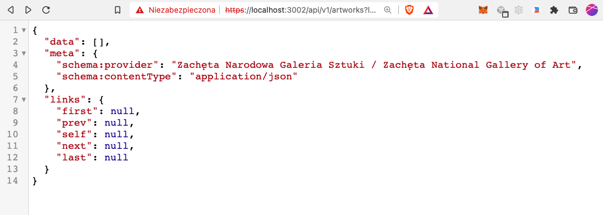

# Plugin Interactive JSON response for Strapi

Plugin for handling text/html requests to api as codemirror augmented application/json response

# Installation

1. Install the plugin

    pnpm install -S https://github.com/yyx990805/strapi-plugin-interactive-json-response.git

2. Go to `config/plugins.(?ts|ts)`

```diff
//
// https://strapi.io/blog/how-to-create-a-strapi-v4-plugin
//
export default {
  // ...
+  'strapi-plugin-interactive-json-response': {
+    enabled: true,
+    resolve: './src/plugins/strapi-plugin-interactive-json-response',
+  },
  // ...
}
```

Note: in case of plugin registration - the order of plugins does not matter.

3. Go to `config/middlewares.(?js|ts)`

```diff
export default [
+  'plugin::strapi-plugin-interactive-json-response.middlewareJson',
  'strapi::errors',
]
```

Note: plugin should be registered as the highest possible.

# Verification of the installation

yarn strapi middlewares:list

```
┌─────────────────────────────────────────────────────────────────┐
│ Name                                                            │
│ plugin::strapi-plugin-interactive-json-response.middlewareJson  │
├─────────────────────────────────────────────────────────────────┤
│ plugin::strapi-plugin-interactive-json-response.middlewareJson2 │
└─────────────────────────────────────────────────────────────────┘
```

# Usage in services/controllers

strapi.middleware('plugin::strapi-plugin-interactive-json-response.middleware-a');

# Screenshot



# Licence

MIT.
